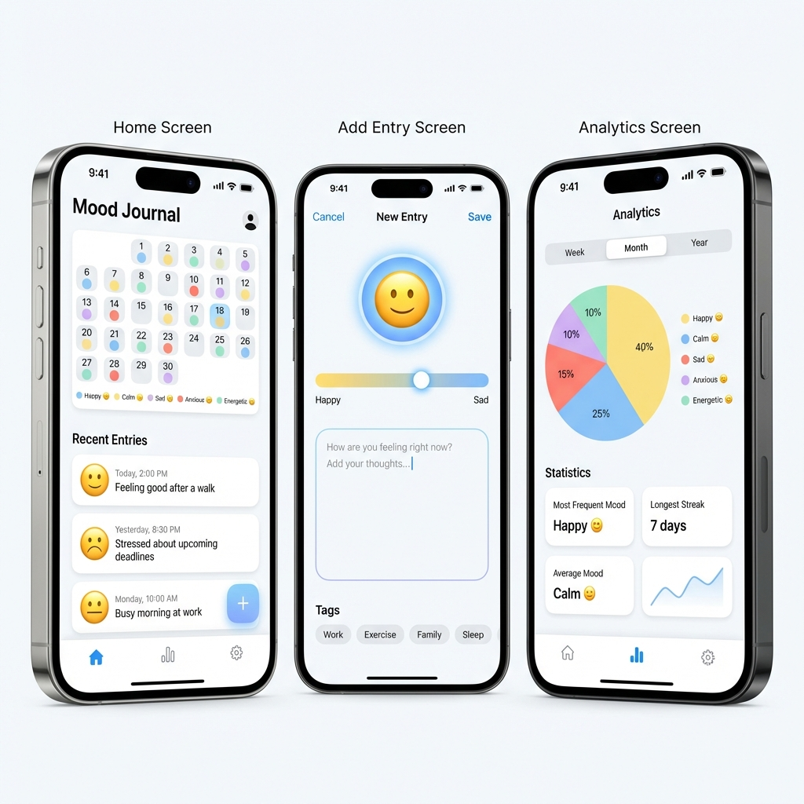

# Mood Journal App

Local-first mood journaling app built with React Native and Expo. The app lets a user record mood entries, tag them, review them on a calendar, and inspect lightweight analytics without relying on a backend or account system.



## Product Summary

The current implementation is a single-device journal experience with:

- mood entry creation, editing, and deletion
- multiple mood entries for the same day
- calendar-based history browsing
- day-level timeline for reviewing all moods logged on a date
- recent-entry list on the home screen
- reusable tags with inline create, rename, merge, and delete flows
- custom mood creation
- weekly, monthly, and yearly analytics views
- read-only weekly review for the most recent completed week
- light and dark theme support
- optional daily reminder notifications
- local persistence through AsyncStorage

## Documentation Map

- [README](./README.md): project overview, setup, and high-level implementation notes
- [docs/architecture.md](./docs/architecture.md): technical structure, runtime flow, and persistence model
- [docs/business-logic.md](./docs/business-logic.md): functional rules, state transitions, and current product behavior

## Tech Stack

- React Native with Expo
- TypeScript in strict mode
- React Navigation native stack
- Zustand with persisted state
- AsyncStorage for local persistence
- Expo Notifications for reminders
- Expo Linear Gradient, React Native Calendars, and React Native Chart Kit for UI

## Getting Started

### Prerequisites

- Node.js LTS
- npm
- Expo Go or a local Android/iOS simulator

### Install

```bash
npm install
```

### Run

```bash
npm start
```

Additional targets:

- `npm run android`
- `npm run ios`
- `npm run web`

## Project Structure

```text
.
|-- App.tsx
|-- index.ts
|-- src
|   |-- components
|   |-- constants
|   |-- screens
|   |-- services
|   `-- types
`-- docs
    |-- architecture.md
    `-- business-logic.md
```

## Main Runtime Pieces

- `App.tsx`: bootstraps the theme provider, navigation container, and stack routes
- `src/screens`: screen-level user flows such as home, entry creation, analytics, and settings
- `src/screens/DayEntriesScreen.tsx`: day-level view that groups multiple moods on the same date
- `src/components`: reusable UI blocks such as mood picker, tag picker, and color selector
- `src/services/store.ts`: persisted application state and most write-side business rules
- `src/services/entryUtils.ts`: date grouping helpers and derived streak/stat calculation
- `src/services/notifications.ts`: Expo notification permission and scheduling helpers
- `src/constants/ThemeContext.tsx`: theme state used by the UI layer

## Data Model

Core persisted entities:

- `MoodEntry`: `id`, `moodId`, `color`, `intensity`, `note`, `timestamp`, optional `tags`
- `CustomMood`: `id`, `name`, `emoji`, `color`
- `UserStats`: `currentStreak`, `longestStreak`, `lastEntryDate`
- `ReminderSettings`: `enabled`, `time`

The main persisted Zustand storage key is `mood-journal-storage`. Theme preference is stored separately under the AsyncStorage key `theme`.

## Current Implementation Notes

These points are important when reading or extending the codebase:

- The app is fully local-first. There is no backend, sync layer, or user authentication.
- Multiple moods per day are supported through multiple entries on the same local date.
- Theme state is managed by `ThemeContext`, while the Zustand store also contains an unused `theme` field.
- Custom moods are available in the picker and home screen, but analytics and entry detail logic only fully resolve built-in moods.
- Entry intensity is stored and displayed, but the current UI does not expose a dedicated intensity control.
- The "Clear All Data" action clears `entries` only. Other persisted slices such as tags, custom moods, reminder settings, and streak metadata remain.

## Development Notes

- TypeScript strict mode is enabled via `tsconfig.json`.
- The Babel config includes the Reanimated plugin.
- Expo new architecture is enabled in `app.json`.

For implementation details, read [docs/architecture.md](./docs/architecture.md) and [docs/business-logic.md](./docs/business-logic.md).
